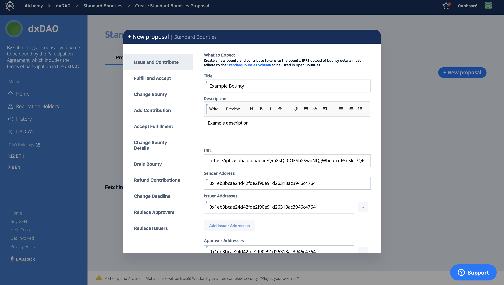
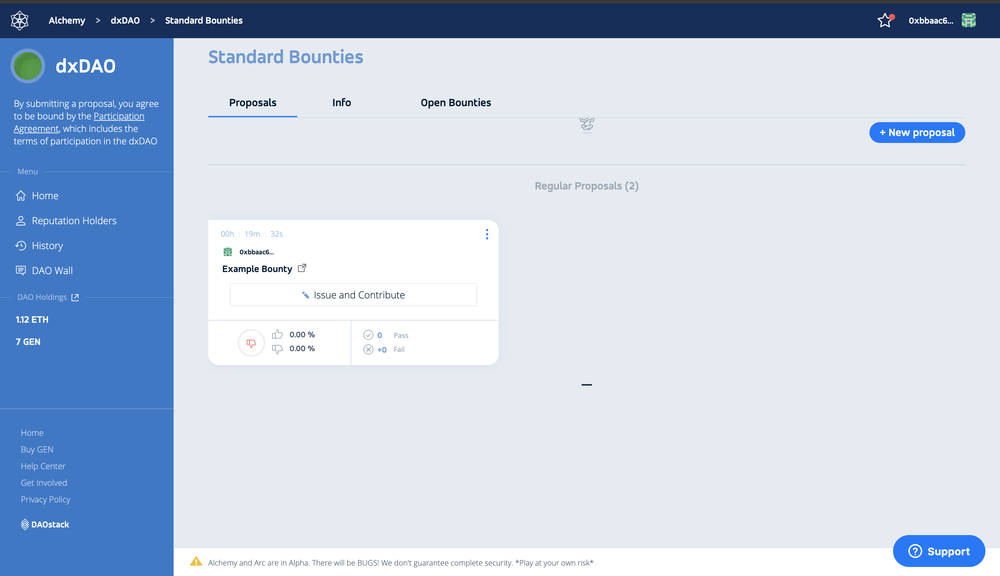
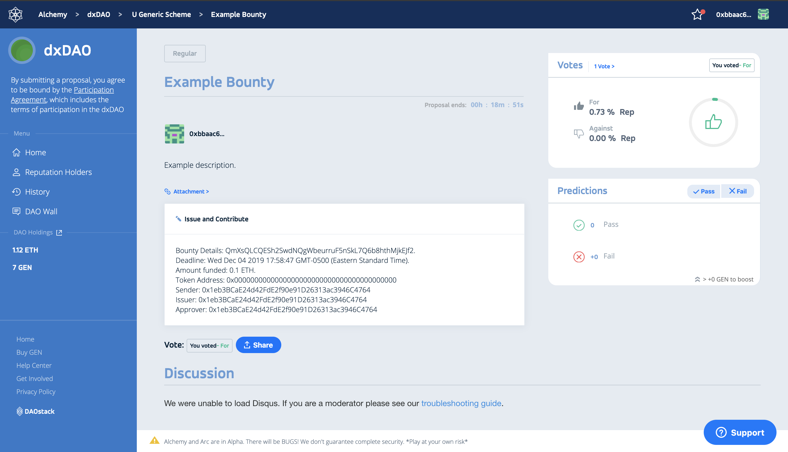
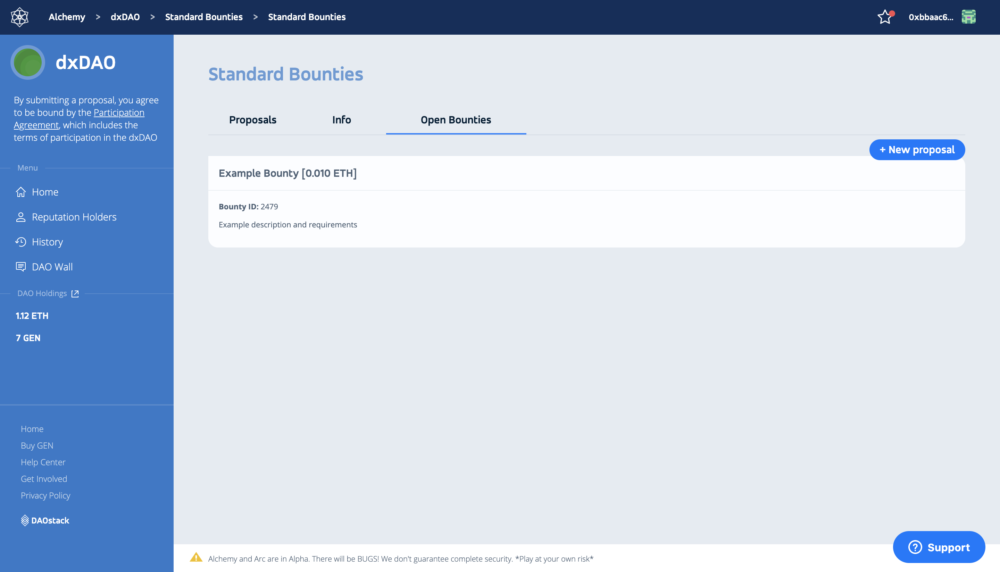
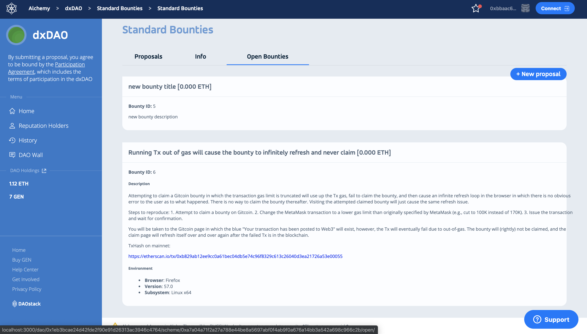

# DAOStack Standard Bounties Scheme

The Standard Bounties scheme allows DAOs on DAOStack to perform actions on [Bounties Network](https://explorer.bounties.network). Bounties are funded projects posted to be completed by freelancers.

The Standard Bounties contract has been used by organizations such as The Ethereum Foundation, Consensys, Hyperledger Besu, etc. using the interface Gitcoin. Here are the Standard Bounties contract details:

- Contract address: https://etherscan.io/address/0xa7135d0a62939501b5304a04bf00d1a9a22f6623
- Contract code: https://github.com/Bounties-Network/StandardBounties/blob/master/contracts/StandardBounties.sol
- Contract audit: https://github.com/ConsenSys/bounties-audit-report-2019-03

The following actions can be performed with new proposals:
- `Issue and contribute`: Creates and funds a new bounty
- `Contribute`: Allows adding funds to an existing bounty
- `Refund Contributions`: Allows refunding bounty contribution, in case of expiration, etc.
- `Drain bounty`: Similar to `Refund Contributions`. Allows for partial refunds
- `Accept Fulfillment`: Accepts a selected bounty submission
- `Change Bounty`: Allows changing all bounty details, including data, deadline, issuers, and approvers.
- `Change Data`: Changes bounty data such as description, task category, approval requirement, etc.
- `Change Deadline`: Allows extending or reducing a bounty deadline
- `Fulfil and accept`: Accepts a submission and releases the payout 
- `Replace Approvers`: Changes approvers
- `Replace Issuers`: Changes issuers

The only actions the DAO calls on the Standard Bounties contract are the ones listed here. 

Once a proposal has been made, the proposal card shows the proposal title, as well as the action requested for the Standard Bounties smart contract.

If a proposal is expanded, all pending action details displayed, allowing for review among the DAO.

Once voting for a Standard Bounties action is passed, the DAO performs the action on the Standard Bounties smart contract, which updates the Bounties Network API. 

All bounties with the DAO as the issuer are displayed in the `Open Bounties` tab in the Standard Bounties Scheme.

To be queried the Open Bounties List, bounty data must follow the [StandardBounties Data Schema](https://github.com/Bounties-Network/StandardBounties/blob/master/docs/standardSchemas.md), and be uploaded as a JSON file to IPFS. The bounty description field of the schema is Markdown. 

As more bounties are issued by the DAO, Open Bounties updates. Bounties are removed as they close. 
